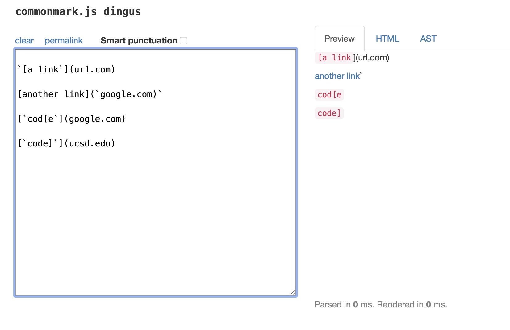
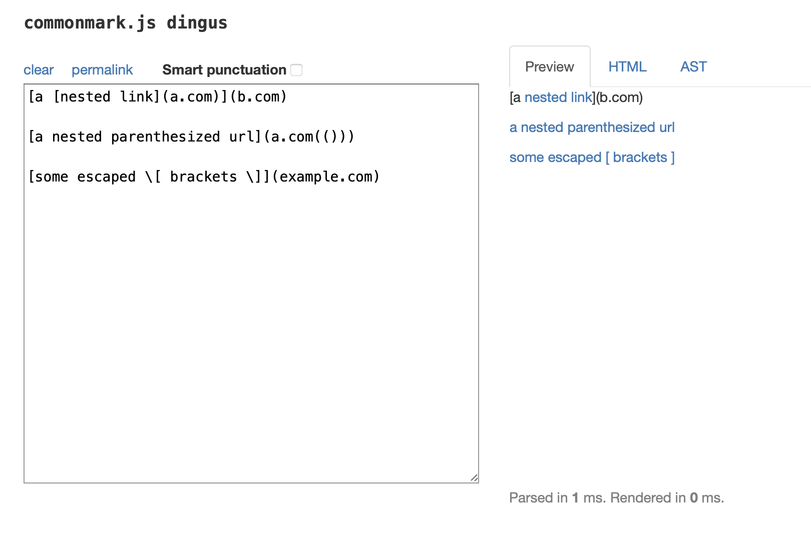
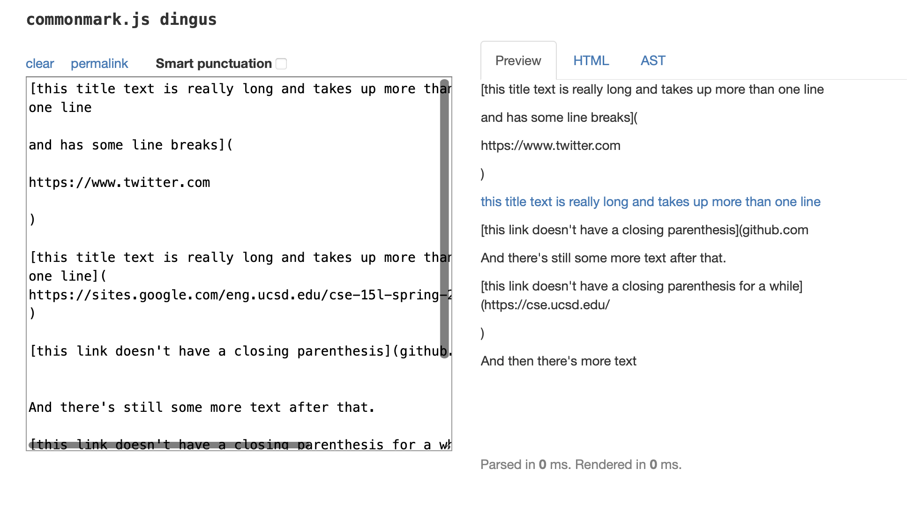

# Name : Shaodong Shan
# Course: CSE 15L Lab 4
>Date: May 19, 2022
>
>This is my fourth lab report, welcome.
>

>
# The link to my markdown-parse repository
[MyMarkdownParse](https://github.com/TooMuchFish/markdown-parser)
>
# The link to the one repository reviewed in week 7
[ReviewedMarkdownParse](https://github.com/ezh247467/markdown-parser.git)
>
# The Expected Out Put For Each Of The Snippet
* 1. snippet 1 in commonmark.js dingus [link](snippet1.png)

___
```
The expect output is [`google.com, google.com, ucsd.edu]
```

>
* 2. snippet 2 in commonmark.js dingus [link](snippet2.png)

___
```
the expect output is [a.com, a.com(()), example.com]
```

>
* 3. snippet 3 in commonmark.js dingus [link](snippet3.png)

___
```
the expect output is [https://www.twitter.com]
```

>

# Run the test with my implementation repository

# Run the test with the reviewed implementation repository in week 7

# Answers the following 3 questions
* 1. Do you think there is a small (<10 lines) code change that will make your program work for snippet 1 and all related cases that use inline code with backticks? If yes, describe the code change. If not, describe why it would be a more involved change.

- No, when we were trying to fix the snippet 1, we are need more than 10 lines of code change, because we have to follow the github language to fix the code format, and there is exist a few cases to consider. For the instance, if the format of code is inside open and close brackets, and if one of the bracket is inside code format, then so on. Therefore, we need some more interchange codes to consider those cases, and the code change will more than 10 lines long.

>
* 2. Do you think there is a small (<10 lines) code change that will make your program work for snippet 2 and all related cases that nest parentheses, brackets, and escaped brackets? If yes, describe the code change. If not, describe why it would be a more involved change.

- No, I do not think there is a way to fix the programing for handing the nest parenthesis with the actual link. If we want to handle the nest parenthesis, we are going to think more about the nest parenthesis special cases. For the instance of it, what could happen if the nest parenthesis appear inside bracket and nest parenthesis appear inside of the actual link parenthesis. Hence, we are need more than 10 lines code to handle this case, we also need to fix the third expected link, since it does not appear in the actual shown list.

>
* 3. Do you think there is a small (<10 lines) code change that will make your program work for snippet 3 and all related cases that have newlines in brackets and parentheses? If yes, describe the code change. If not, describe why it would be a more involved change.

- No, we need involve more code to editing the program to handle snippet 3 for this case. Because we need to handle the case when the link does not hava a closed parenthesis, and we need to handle the space or lines  even more lines break between the close bracket, then we also need to trim the spaces with the link which only show the useful part of the link.

>
# Thank you
>This is the end of my lab report 4. Thanks for your watching.
  

